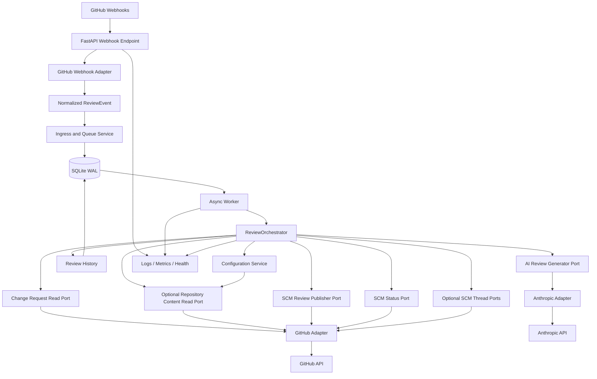

# Revio Architecture and Implementation Plan

Status: Proposed
Scope: Planning only
Reference implementation: GitHub App + Anthropic + diff-only reviews

## 1. Executive summary

Revio will be a provider-neutral AI code-review service. Its first production path is:

```text
GitHub App -> verified webhook -> durable SQLite job -> async worker
-> provider-neutral ReviewOrchestrator -> GitHub and Anthropic adapters
-> inline findings, summary, and review status
```

The core must contain no GitHub, GitLab, Bitbucket, Anthropic, OpenAI, or Gemini SDK types and no provider-name conditionals. Provider differences are represented through adapters and explicit capability models.

The smallest useful production MVP comprises Phases 0 through 7. Phase 4 is the first end-to-end demonstration, but reliability, configuration, finding lifecycle, security hardening, and observability are needed before production use.

## 2. Product boundaries

### Initial product

- GitHub-hosted repositories authenticated through a GitHub App
- Pull request webhook reviews
- Anthropic through an administrator-approved model alias
- Diff-only structured reviews
- Inline comments, summary comments, confidence routing, and review status
- SQLite WAL durable queue, retry, recovery, and idempotency
- Per-repository `.revio.yml`
- Duplicate prevention and unchanged-diff skipping
- JSON logs, Prometheus metrics, health, and readiness
- Single-node Docker Compose deployment

### Designed now, implemented later

- GitLab.com and self-managed GitLab
- Bitbucket Cloud and Bitbucket Data Center as separate adapters
- OpenAI, Azure OpenAI, Gemini, Bedrock, and compatible endpoints
- Context-aware agent mode, thread replies, and reviewer re-requests
- PostgreSQL, horizontal workers, organization policy, and cost controls

### Explicitly prohibited initially

Revio will not approve or merge changes, push commits, modify repository settings, trigger deployments, create releases, execute repository code, accept repository credentials, or persist complete source files and diffs by default.

## 3. High-level architecture

Use ports and adapters with four boundaries:

1. Ingress verifies and normalizes provider webhooks.
2. Application services enqueue work and orchestrate reviews.
3. Ports define SCM, AI, persistence, clock, and metrics contracts.
4. Adapters implement GitHub, Anthropic, SQLite, and Prometheus behavior.

The target production webhook endpoint validates, normalizes, persists, and returns quickly. Workers perform network calls. Adapters are resolved before the orchestrator is invoked; the orchestrator checks capabilities rather than provider names. Phase 2 implements validation and normalization only for local/sandbox use; atomic delivery and queue-job persistence, and therefore any production webhook deployment, begin in Phase 3.



## 4. Webhook and review sequence

This sequence is the target production flow after Phase 3. In Phase 2, it stops after local/sandbox signature validation and event normalization; no delivery or job durability is claimed.

```mermaid
sequenceDiagram
    participant GH as GitHub
    participant API as Webhook API
    participant WA as GitHub Webhook Adapter
    participant DB as SQLite
    participant Worker
    participant Core as ReviewOrchestrator
    participant SCM as GitHub SCM Adapter
    participant AI as Anthropic Adapter

    GH->>API: Signed pull_request webhook
    API->>API: Limit body and verify signature
    API->>WA: Normalize headers and payload
    WA-->>API: ReviewEvent
    API->>DB: Insert delivery and job atomically
    API-->>GH: 202 Accepted
    Worker->>DB: Lease available job
    Worker->>Core: Process ReviewEvent
    Core->>SCM: Fetch current ChangeRequest metadata
    break Event head is stale
        Core->>DB: Supersede/cancel stale job
        Core-->>Worker: Superseded; do not review or publish
    end
    Core->>SCM: Get diff at current head and .revio.yml at current base
    SCM-->>Core: Normalized metadata and DiffFiles
    Core->>Core: Validate/merge base config or use defaults + warning
    Core->>SCM: Create/reconcile one queued Check Run
    SCM-->>Core: Check Run ID; persist it
    alt Disabled, excluded, or unchanged
        Core->>SCM: Update same Check Run to neutral
    else Review required
        Core->>SCM: Update same Check Run to in progress
        Core->>AI: review(ReviewRequest)
        AI-->>Core: ReviewResult and TokenUsage
        Core->>Core: Validate, route, and deduplicate
        Core->>DB: Reserve stable publish operation key
        Core->>SCM: Publish marked review or reconcile existing marker
        SCM-->>Core: Provider review ID
        Core->>DB: Record provider review ID and complete operation
        Core->>DB: Persist run, usage, and identities
        Core->>SCM: Update same Check Run to terminal status
    end
    Core-->>Worker: Outcome
    Worker->>DB: Complete or reschedule job
```

## 5. Normalized domain model

Use immutable Pydantic models where validation or serialization is useful, with enums and small value objects.

- Identity: `ProviderId`, `InstallationRef`, `RepositoryRef`, `ChangeRequestTarget`, `CommitRef`, `Actor`, `ReviewEventIdentity`
- Repository data: `Repository`, `Installation`, `ChangeRequest`, `DiffFile`, `DiffLine`, `RepositoryEntry`, `FileContent`
- Review data: `ReviewMode`, `ReviewEvent`, `ReviewRequest`, `ReviewResult`, `Finding`, `TokenUsage`
- Lifecycle: `ReviewThread`, `ReviewComment`, `PostedComment`, `FindingIdentity`, `PriorFinding`, `FindingDisposition`, `ReviewStatus`, `ReviewRun`, `ReviewOutcome`

`ProviderId` is a validated, registry-friendly value object such as `github` or `gitlab-self-managed`, not a closed enum. New adapters can register new identifiers without editing the domain. Repository identity is the composite `(provider ID, installation/account/workspace ID, repository ID)`. Provider DTOs and unknown provider fields remain inside adapters.

`ReviewResult` contains findings, summary, partial and fallback flags, and normalized usage. `TokenUsage` separately records uncached input, cached input, cache creation, and output tokens.

## 6. Segregated SCM interfaces

Adapters implement only the protocols for capabilities they actually provide. The registry returns a typed `SCMAdapterBundle`; future methods are not mandatory stubs.

```python
class ChangeRequestReadPort(Protocol):
    async def get_change_request(self, target: ChangeRequestTarget) -> ChangeRequest: ...
    async def get_diff(self, target: ChangeRequestTarget) -> list[DiffFile]: ...

class RepositoryContentReadPort(Protocol):
    async def get_file(
        self, target: ChangeRequestTarget, path: RepositoryPath, ref: CommitRef
    ) -> FileContent | None: ...
    async def get_tree(
        self, target: ChangeRequestTarget, path: RepositoryPath, ref: CommitRef
    ) -> list[RepositoryEntry]: ...

class ReviewPublisherPort(Protocol):
    async def publish_review(
        self, target: ChangeRequestTarget, review: PublishReviewRequest,
        operation_key: str
    ) -> PublishedReview: ...

class ReviewStatusPort(Protocol):
    async def set_review_status(
        self, target: ChangeRequestTarget, status: ReviewStatus,
        details: ReviewStatusDetails
    ) -> None: ...

class ThreadReaderPort(Protocol):
    async def list_review_threads(
        self, target: ChangeRequestTarget
    ) -> list[ReviewThread]: ...

class ThreadResolverPort(Protocol):
    async def resolve_thread(
        self, target: ChangeRequestTarget, thread_id: str
    ) -> None: ...

class ThreadReplyPort(Protocol):
    async def reply_to_thread(
        self, target: ChangeRequestTarget, thread_id: str,
        body: SafeMarkdown, operation_key: str
    ) -> PostedComment: ...
```

`publish_review` is provider-neutral and accepts the summary plus validated inline findings. The GitHub adapter should prevalidate anchors and, where practical, create one `COMMENT` pull-request review containing the summary and all eligible inline comments. Findings with invalid or stale anchors move into the summary.

Publishing uses an explicit reconciliation protocol:

1. Reserve a unique, stable operation key in persistence before the provider call.
2. Embed a stable hidden Revio marker derived from that key in the GitHub review body, for example an HTML comment containing no sensitive data.
3. Publish the review.
4. If the call times out or has an ambiguous outcome, query existing pull-request reviews for that marker before retrying.
5. On a match or successful creation, record the provider review ID against the reserved operation before marking it complete.

A reserved operation without a provider ID remains reconcilable; it is never treated as permission to publish blindly. The same pattern applies to later providers using the strongest provider-supported lookup identity.

Supporting ports include `WebhookAdapter`, `SCMAdapterRegistry`, `InstallationCredentialProvider`, and `RepositoryConfigLoader`. A bundle exposes optional repository-content, thread, publishing, and status ports according to its capability descriptor; adapters do not implement unsupported future methods merely to throw errors. Phase 2 GitHub supplies both change-request and repository-content reads; a future adapter without tree/file access can implement only change-request reads.

## 7. Segregated AI interfaces and model resolution

```python
class AIReviewGenerator(Protocol):
    async def review(self, request: ReviewRequest) -> ReviewResult: ...

class AIConversationGenerator(Protocol):
    async def generate_thread_reply(
        self, request: ThreadReplyRequest
    ) -> ThreadReplyResult: ...
```

An `AIAdapter` may expose one or both protocols. Provider-wide behavior belongs in `AIProviderCapabilities` (authentication/API family, usage-reporting support, streaming transport, and retry/error classification). Model-dependent behavior belongs in an immutable `ResolvedModelProfile` produced from an administrator-approved alias. It contains the provider ID, opaque provider model/deployment identifier, context/output limits, structured-output mode, tool support, prompt-cache support and constraints, and enabled review modes. Repository configuration can select only approved aliases if selection is enabled later.

Adapters construct provider requests from the resolved profile, validate structured responses, normalize exact usage, classify errors, and redact unsafe error details. The queue controls job-level retry; adapters may perform only bounded, safe transport retries.

Use a hybrid provider strategy: native adapters where advanced behavior matters, plus a later distinct OpenAI-compatible adapter for approved generic endpoints. LiteLLM may be an optional implementation but not the core abstraction because it can hide meaningful tool, schema, cache, usage, deployment, and error differences.

OpenAI is recommended as the second provider. It offers a materially different structured-output ecosystem, validates the abstraction well, and creates a path to a separate compatible-endpoint adapter. Azure remains separate because its deployment identity, endpoints, authentication, and API lifecycle differ.

## 8. Capability models

`SCMCapabilities` initially declares inline comments, summary comments, threaded replies, resolvable threads, reviewer-assignment events, re-request events, check runs, commit statuses, suggested changes, repository file access, tree access, webhook UUIDs, and installation authentication.

`AIProviderCapabilities` declares provider/API-wide properties such as usage reporting, streaming transport, image transport support, and retryable error classification. `ResolvedModelProfile` declares context and output limits, structured-output support/mode, native tool support, prompt caching, image support, and allowed review modes for the selected model alias.

Capabilities describe real behavior. Missing inline support routes findings to the summary; missing resolution support records the outcome without claiming thread resolution; providers without reliable tools remain diff-only. Add richer constraint objects only when implemented providers demonstrate the need.

## 9. GitHub webhook normalization

This section describes the target production ingress flow once Phase 3 exists. Phase 2 exercises steps 1 through 5 only in local/sandbox environments. Phase 3 introduces the atomic persistence in step 6 and permits the complete flow to receive production traffic.

Initially subscribe to installation lifecycle events and `pull_request` actions `opened`, `reopened`, and `synchronize`. Add review requests and comment events later.

Ingress processing:

1. Enforce route, media type, and byte limit.
2. Validate `X-Hub-Signature-256` with constant-time comparison.
3. Require `X-GitHub-Delivery`.
4. Parse a private GitHub payload model.
5. Map supported actions into `ReviewEvent`.
6. Atomically persist sanitized delivery metadata, payload hash, event, and job.
7. Return 202; valid unsupported actions become documented no-ops.

Use two identities:

- Delivery identity: provider plus webhook UUID, preventing redelivery replay.
- Semantic identity: target plus trigger-specific material. Commit reviews use head SHA; genuine re-requests include reviewer/team and occurrence; developer replies use provider note IDs.

An unchanged-diff policy is separate from ingress idempotency. At worker processing time, always fetch the current `ChangeRequest`. The current head SHA governs diff retrieval, review generation, anchor validation, publishing, and finding revalidation; the current base SHA governs trusted `.revio.yml` loading. If the event head SHA no longer matches the current head, supersede or cancel the stale job rather than reviewing or posting against obsolete state. A current-head event already represented by another semantic job is deduplicated. Delayed and out-of-order delivery behavior is tested explicitly.

## 10. GitHub App authentication

- Load App ID and PEM key from environment or a secret mount.
- Generate short-lived App JWTs and exchange them for installation tokens.
- Cache tokens in memory until shortly before expiry with per-installation refresh locking.
- Do not persist installation tokens in the single-node MVP.
- Verify each repository belongs to the webhook installation before issuing credentials.

Least-privilege permissions: pull requests read, contents read, review comments write, and either checks write or commit statuses write. Check runs are recommended for richer lifecycle reporting. Never support a personal access token as the platform authentication model.

The GitHub adapter may use REST for pull-request, diff, review publishing, and check-run operations while using GraphQL for review-thread discovery and the `resolveReviewThread` mutation. These API choices and node-ID translations remain private to the adapter.

GitHub Check Run conclusions are informational in the initial product:

- queued: accepted
- in progress: reviewing
- success: review completed, including a review containing findings
- neutral: partial review or intentional skip
- failure: operational failure to perform the review

Findings do not produce a failure conclusion and are not merge-blocking. Repository administrators may choose branch rules independently, but Revio's initial status semantics do not treat findings as a failed check.

Create or discover exactly one GitHub Check Run for a review run, persist its provider Check Run ID, and update that same Check Run through queued, in-progress, and terminal states. Ambiguous creation is reconciled using its stable external identity before retry; state transitions must not create a separate Check Run.

## 11. Configuration

Service configuration uses Pydantic Settings sections for server, database, queue, SCM and AI providers, review defaults, security, observability, and rollout. YAML contains environment-variable references or secret-file references, never literal secrets.

Repository configuration is strict and versioned. For every review, load `.revio.yml` from the trusted pull-request **base commit SHA**, never the unmerged head. A configuration change proposed by a pull request becomes active only after it is merged and becomes part of the base of a later review:

```yaml
version: 1
enabled: true
review:
  mode: diff_only
  focus_areas: [correctness, security]
  excluded_paths: ["vendor/**", "generated/**"]
  confidence_thresholds:
    inline: 0.75
    summary: 0.50
```

Precedence is:

```text
hard security ceilings
-> service defaults and administrator policy
-> validated repository configuration
```

Repository configuration may narrow behavior but cannot supply secrets, enable disabled providers, raise security ceilings, choose arbitrary endpoints/models, disable mandatory policy, remove protected exclusions, or override administrator rollout and security controls. `enabled: false` is honored only when administrator policy explicitly permits repository-level opt-out. Mandatory installation or future organization policy always wins and cannot be disabled by repository configuration. Missing configuration uses secure service defaults. Invalid, oversized, or malicious configuration must not skip the review: Revio falls back to secure service defaults and includes a visible configuration warning in the published review/status. Config parsing failures are logged and measured without reproducing unsafe content.

## 12. Queue and persistence

Use SQLite WAL, migrations, one API process, and one async worker. Queue and application data share a database and transaction manager in the MVP, while using separate repository interfaces. This permits atomic webhook receipt and job creation.

Queue jobs have pending, running, retry-wait, completed, dead, and cancelled states; leases and expiry; bounded attempts; exponential backoff with jitter; stale-lease recovery; and unique idempotency keys. Network calls never occur inside database transactions.

Suggested tables:

- `scm_installations`, `repositories`, `webhook_deliveries`
- `queue_jobs`, `review_runs`, `provider_calls`, `provider_usage`
- `finding_records`, `publish_operations`, `posted_comments`, `review_thread_links`
- persisted provider review IDs and the single provider Check Run ID for each review run
- optional bounded `audit_events`, plus `schema_migrations`

Persist hashes and normalized metadata, not source snapshots. SQLAlchemy Core async plus Alembic is recommended. PostgreSQL later supplies `FOR UPDATE SKIP LOCKED` leasing and horizontal workers. Redis is not necessary initially.

## 13. Finding identity and lifecycle

Use three complementary identities:

1. Primary fingerprint: versioned hash of repository identity, normalized path, normalized category/rule, normalized code anchor or symbol, and a bounded normalized code snippet.
2. Secondary fingerprint: normalized title plus category and path, used conservatively.
3. Provider identity: posted comment/thread ID.

Raw line number is anchoring metadata, not primary identity. Free-form AI reasoning, explanation text, remediation prose, confidence wording, and other generated narrative must never enter the primary fingerprint. The model supplies structured identity material; the core validates it and computes the versioned fingerprint. Normalize whitespace, paths, category/rule values, symbols/anchors, and only a bounded code snippet; do not use fuzzy or embedding matching in the MVP.

Prior findings must be explicitly selected for revalidation using a deterministic, administrator-bounded maximum per review. Selection favors open findings relevant to changed paths and records both selected and unselected identities. Revalidation fetches the current file at the **latest pull-request head SHA**, even when the original line is absent from the new diff, and returns only the dedicated `FindingRevalidationResult` states:

- `fixed`: resolve only when explicitly supported by evidence from the current file.
- `still_present`: keep open.
- `uncertain`: keep open.

Only selected findings returned as `fixed` may be resolved. Unselected findings and selected findings returned as `uncertain` or `still_present` remain open. A fetch failure, truncated file, excluded/protected path, limit exhaustion, or ambiguous evidence produces `uncertain`, never `fixed`.

Absence from a later diff is not proof of resolution. Claims that code is missing, removed, renamed, or no longer executed require current-file verification when available; otherwise the finding is omitted or remains uncertain. A normalized diff hash supports unchanged-review skipping but does not replace webhook idempotency.

## 14. Security architecture

- HMAC verification before JSON processing
- Strict request, diff, file, output, token, and time limits
- Least-privilege GitHub App permissions and managed secrets
- Redaction of tokens, authorization headers, secrets, and unsafe errors
- Composite tenant identity and scoped persistence access
- Safe Markdown rendering and comment-size limits
- Repository-relative normalized paths; block absolute paths and traversal
- Mandatory secret-file exclusions and administrator exclusions
- Treat code, diffs, descriptions, comments, and configuration as untrusted
- Separate instructions from repository content in prompts
- Validate and secret-scan output before posting
- Administrator-only provider endpoints with HTTPS, host/address validation, redirect checks, and metadata/private-address blocking unless explicitly approved
- Ingress and provider rate limits
- Dependency pinning, updates, secret scanning, dependency audit, and SAST
- Never execute repository code

Future durable credentials use envelope encryption with a managed KMS. Agent mode receives a separate security review.

## 15. Observability

- `/health`: process liveness without dependency checks
- `/ready`: migrations current, database writable, queue usable, required configuration valid
- `/metrics`: Prometheus endpoint, preferably internal/protected

JSON logs include correlation, delivery, job, review-run, provider, outcome, and error-class fields. Repository, PR, SHA, installation, and user identifiers do not become metric labels.

Metrics cover webhook validation/deduplication, queue depth/age/outcomes, review duration/outcomes, SCM and AI call duration/errors, findings routing, prior revalidation, resolution, partial/fallback reviews, token categories, cache usage, and provider/model-alias distribution.

Emit AI metrics once per provider call and aggregate review metrics once per review. These semantics must remain distinct.

## 16. Repository structure

```text
revio/
├── src/revio/
│   ├── api/
│   ├── domain/
│   ├── application/{review,webhook,services}/
│   ├── ports/
│   ├── adapters/{scm/github,ai/anthropic,persistence/sqlite}/
│   ├── queue/
│   ├── config/
│   ├── observability/
│   ├── security/
│   └── main.py
├── tests/{unit,contracts,github,anthropic,persistence,integration,fixtures}/
├── migrations/
├── docs/{architecture,adr,providers,runbooks}/
├── deploy/
├── .github/workflows/
├── .revio.yml.example
├── .env.example
├── Dockerfile
├── docker-compose.yml
├── pyproject.toml
├── README.md
├── SECURITY.md
├── CONTRIBUTING.md
├── CODE_OF_CONDUCT.md
└── LICENSE
```

Keep repository and package names as `revio`. Recommended tools are Python 3.12, uv, Ruff, Pyright, pytest, pytest-asyncio, respx, coverage, pre-commit, GitHub Actions, Dependabot, CodeQL, and secret scanning. Apache-2.0 is the recommended license, subject to approval.

## 17. Testing and provider contracts

Testing layers include domain units, orchestrator tests with small fake ports, capability-composition tests, signature/normalization fixtures, delayed/out-of-order webhook and stale-job tests, respx adapter tests, SQLite lease/recovery tests, publishing reconciliation tests, migrations, security boundaries, trusted-base configuration/opt-out/fallback tests, model-profile resolution, fake-provider integration tests, Docker smoke tests, and optional non-blocking live sandbox tests.

SCM contracts are protocol-specific so an adapter runs only the suites for ports it implements. They cover normalized identity, path/diff behavior, declared capability composition, batched publishing, anchor prevalidation and summary fallback, operation reservation, hidden-marker reconciliation after timeout, provider-ID recording, single-Check-Run updates, Check Run mapping, pagination, authentication refresh, rate limits, error taxonomy, and thread identities. GitHub-specific tests verify REST/GraphQL translation without exposing it to core tests.

AI review and conversational contracts are separate. They cover result validation, empty/multiple findings, malformed output, partial/fallback flags, usage/cache mapping, rate limits, context errors, timeouts, refusals, provider capability accuracy, and alias-to-`ResolvedModelProfile` behavior. Every model-aware feature is tested from the resolved profile rather than assumed from the provider.

Fixtures must be synthetic or sanitized. Inject clocks and randomness for deterministic queue tests.

## 18. Phased roadmap and acceptance criteria

Each phase uses a feature branch and pull request, includes tests, and requires explicit approval before the next phase starts.

### Phase 0 — Repository and engineering foundation

- **Goal:** Establish a safe, repeatable development baseline.
- **Scope/files:** Package skeleton, `pyproject.toml`, CI, Docker, tests, examples, README, SECURITY, CONTRIBUTING, license, ADR template.
- **Delivered behavior:** Importable package, minimal FastAPI process, test command, container health smoke test.
- **Tests:** Import, app construction, health smoke, CI matrix.
- **Manual validation:** Run format, lint, typing, tests, and Compose; open a PR.
- **Limitations/out of scope:** No domain, providers, persistence, webhook, or AI.
- **Completion:** CI green, workflow documented, no private data or secrets.

### Phase 1 — Provider-neutral domain and interfaces

- **Goal:** Establish the core language and contracts.
- **Scope/files:** `domain/`, segregated SCM/AI/persistence ports, `ProviderId`, provider and model capabilities, `ResolvedModelProfile`, registries, error taxonomy, protocol-specific contract harness, ADRs.
- **Delivered behavior:** Composable fake SCM ports and a fake AI review generator drive an orchestrator skeleton; unsupported future features need no stub methods.
- **Tests:** Model/identity validation, alias/profile resolution, capability composition, registries, per-port fake contracts, forbidden dependency checks.
- **Manual validation:** Run a scripted fake review flow.
- **Limitations/out of scope:** No HTTP, database, GitHub, or Anthropic.
- **Completion:** Core imports no provider SDK and contract behavior is documented.

### Phase 2 — GitHub webhook and GitHub App integration

- **Goal:** Securely receive GitHub events and perform read-only PR operations.
- **Scope/files:** Local/sandbox webhook route/normalizer, signature verification, installation tokens, current PR/diff/file reads, fixtures, local delivery tooling. No delivery/job persistence.
- **Delivered behavior:** In a local or sandbox environment only, signed events normalize and the adapter returns normalized PR and diff data.
- **Tests:** Signatures, limits, actions, normalization, current ChangeRequest retrieval, token expiry, pagination, rate limits, diff parsing, redaction. Persistence behavior is expressly absent.
- **Manual validation:** Signed local webhook and optional sandbox GitHub App retrieval.
- **Limitations/out of scope:** Webhook work is non-durable; no AI, comments, or production traffic. Deployment documentation must explicitly prevent production enablement.
- **Completion:** Validation/normalization is demonstrated locally; no PAT path; GitHub DTOs remain inside the adapter; permissions are documented; no delivery/job durability is claimed and the production deployment gate remains closed.

### Phase 3 — Durable queue and persistence

- **Goal:** Make accepted webhook work durable and retryable.
- **Scope/files:** SQLite adapter, migrations, atomic delivery/job persistence, queue, leasing, worker, retry/backoff, dead jobs, stale recovery, current ChangeRequest validation, stale-job supersession, readiness.
- **Delivered behavior:** Ingress delivery and enqueue become atomic. The worker re-fetches current metadata, uses current head/base SHAs, supersedes stale event-head jobs, and recovers safely after crashes.
- **Tests:** Atomic receipt, delivery/semantic duplicates, delayed and out-of-order webhooks, changed head between enqueue/lease, stale supersession, lease concurrency, retry, stale recovery, restart, migration, shutdown.
- **Manual validation:** Queue an old-head event, advance the PR, confirm the job is superseded without review, then kill/restart a valid leased job and verify recovery.
- **Limitations/out of scope:** Jobs stop before AI; no PostgreSQL, Redis, or admin UI.
- **Completion:** Atomic delivery/job persistence is proven; stale jobs cannot publish; tested failures lose no jobs; readiness reflects persistence; only then may webhook ingestion be considered for production deployment.

### Phase 4 — Anthropic diff-only review MVP

- **Goal:** Produce the first end-to-end GitHub review.
- **Scope/files:** Anthropic review generator, administrator alias resolver/model profiles, prompt/schema versions, orchestrator, limits, confidence routing, operation reservations and publishing reconciliation, batched review publishing, one persisted Check Run ID, usage.
- **Delivered behavior:** A queued PR generates one GitHub `COMMENT` review containing a summary and eligible inline findings where practical; invalid anchors appear in the summary. Check Run success means review completion even when findings exist.
- **Tests:** Model-aware structured output/cache/context behavior, malformed responses, timeouts/rate limits, usage, routing, anchor prevalidation/fallback, pre-call reservation, hidden marker lookup after ambiguous failure, provider review ID recording, Check Run ID reuse/semantics, batched publishing and retry safety.
- **Manual validation:** Review a deliberately flawed sandbox PR, verify one non-blocking Check Run is updated through its lifecycle and one practical marked review is published, then simulate an ambiguous timeout and reconcile without duplicate output.
- **Limitations/out of scope:** Service defaults; no agent, second AI, fuzzy lifecycle, or replies.
- **Completion:** End-to-end review succeeds with bounded structured output and correct per-call usage; ambiguous publishing reconciles without duplicates; the persisted provider review ID and single reused Check Run ID are present before their operations complete.

### Phase 5 — Repository configuration and rollout basics

- **Goal:** Safely tailor repository behavior.
- **Scope/files:** Strict `.revio.yml` v1 loaded from the current base commit, loader/merger, secure fallback/warnings, protected exclusions, focus areas, thresholds, enabled flag, rollout allow-list.
- **Delivered behavior:** Valid trusted-base preferences affect reviews within mandatory service policy. `enabled: false` opts out only if administrator policy allows it. Invalid/malicious config falls back to secure defaults and produces a visible warning without skipping review. A PR config edit activates only after merge.
- **Tests:** Base-versus-head config, config activation after merge, permitted/prohibited opt-out, mandatory installation/organization policy, missing/valid/invalid/oversized/malicious config, warning publication, protected controls, precedence, globs, base-SHA caching.
- **Manual validation:** Propose a config change and prove it is inactive on that PR, active in a later PR after merge, and unable to suppress review when invalid.
- **Limitations/out of scope:** No organization layer, credentials, custom endpoints/prompts, or arbitrary model IDs.
- **Completion:** Configuration is always read from the current exact base SHA; invalid config reviews with defaults plus warning; opt-out works only when allowed; mandatory installation/organization policy and administrator controls cannot be overridden.

### Phase 6 — Deduplication and finding lifecycle

- **Goal:** Prevent repeated noise and conservatively manage earlier findings.
- **Scope/files:** Fingerprint service, finding persistence, diff hash, bounded prior selection, latest-head file fetch, three-state revalidation, GitHub thread discovery/resolution, thread linkage.
- **Delivered behavior:** Exact semantic duplicates do not repost. Selected prior findings are checked against the current file at the latest head SHA and return `fixed`, `still_present`, or `uncertain`; only explicit `fixed` results resolve.
- **Tests:** Fingerprint version/fields, exclusion of AI prose and remediation, bounded snippet normalization, conservative title identity, selection bound, latest-current-head ref, fetch failure/truncation, line movement, wording change, same title/different evidence, unchanged/new commits, all three states, selected/unselected behavior, REST/GraphQL adapter isolation.
- **Manual validation:** Move, retain, fix, obscure, and make unavailable a sandbox issue; verify only selected and confirmed-fixed threads resolve.
- **Limitations/out of scope:** No fuzzy/embedding matching or unverified resolution.
- **Completion:** Primary fingerprints use only the specified stable normalized fields and exclude generated prose; every resolution has latest-current-head evidence; selection never exceeds its limit; still-present, uncertain, and unselected findings remain open.

### Phase 7 — Production observability, hardening, and rollout

- **Goal:** Make the single-node MVP operable and safely deployable.
- **Scope/files:** JSON logging, metrics, security controls, rate limits, rollout policy, runbooks, backup/restore guidance.
- **Delivered behavior:** Operators can diagnose queue, SCM, AI, and review outcomes without high-cardinality metrics.
- **Tests:** Metric semantics/cardinality, log redaction, readiness transitions, rate and resource limits, graceful shutdown.
- **Manual validation:** Drill success, duplicates, retries, partials, dead jobs, disabled repos, and recovery.
- **Limitations/out of scope:** Single node; no admin UI, horizontal scale, or multi-region recovery.
- **Completion:** Runbook drill succeeds, secrets do not appear in logs, and rollout can be constrained.

Phase 7 completes the smallest production MVP.

### Phase 8 — OpenAI second provider

- **Goal:** Prove genuine AI portability.
- **Scope/files:** Native OpenAI review generator, provider capabilities, administrator aliases and model profiles, config, contracts, structured output, usage/errors.
- **Delivered behavior:** The same request uses Anthropic or OpenAI without orchestrator changes.
- **Tests:** Shared contracts plus OpenAI-specific schema, usage, context, and error cases.
- **Manual validation:** Run the same synthetic review through both providers.
- **Limitations/out of scope:** No Azure, Gemini, LiteLLM, or arbitrary compatible endpoints.
- **Completion:** Both adapters pass contracts and no provider branch enters orchestration.

### Phase 9 — GitLab adapter

- **Goal:** Validate SCM neutrality for GitLab.com and self-managed GitLab.
- **Scope/files:** GitLab webhook/SCM adapters, validated base URL, auth, MR diffs/files/discussions/statuses.
- **Delivered behavior:** Merge requests use the same core review workflow.
- **Tests:** Shared contracts, actions, pagination, positions, discussions, auth, SSRF controls, rate limits.
- **Manual validation:** Review sandbox MRs on GitLab.com and an approved self-managed instance.
- **Limitations/out of scope:** No Bitbucket or universal provisioning.
- **Completion:** No GitLab conditionals in core; contracts and endpoint security pass.

### Phase 10 — Generic agent mode

- **Goal:** Safely add repository context and factual verification.
- **Scope/files:** Agent strategy, `get_file`/`get_tree` tools, path/secret protections, limits, verification provenance, injection defenses.
- **Delivered behavior:** Capable SCM/AI pairs inspect bounded context; unsupported providers stay diff-only.
- **Tests:** Traversal, exclusions, secret/large files, injection, exhaustion, unsupported capabilities, verified claims.
- **Manual validation:** Test misleading diffs where current-file context changes the outcome.
- **Limitations/out of scope:** No shell, code execution, broad search/index, or autonomous changes.
- **Completion:** Context claims carry verification provenance and limit exhaustion yields a partial review.

### Later phases

Plan and approve separately: Bitbucket Cloud, Bitbucket Data Center, guarded thread replies, reviewer re-requests, PostgreSQL/horizontal workers, organization policy, admin/audit controls, and cost budgets.

## 19. Risks and tradeoffs

- SQLite is appropriate for one node but not horizontal scaling; keep transactions short.
- Inline anchors can become stale; re-fetch current head/diff and degrade to summary.
- GitHub review batching can fail as a unit if one anchor races with a new push; prevalidate, confirm the current head, and retry once with invalid anchors moved to the summary under the same operation identity.
- Provider calls can succeed while the client observes a timeout; durable reservation plus marker reconciliation and provider-ID recording are required to avoid duplicate reviews and Check Runs.
- Hidden review markers must be stable and searchable but contain no tenant secrets or sensitive identifiers.
- AI output remains nondeterministic; validate it and version prompt/schema inputs.
- Provider-level capability claims can overstate individual models; all context, structured-output, tool, and cache decisions must use the resolved model profile.
- Exact fingerprints may miss rewritten duplicates, but are safer than fuzzy resolution.
- Free-form AI prose is especially unstable and must remain outside primary fingerprints.
- Webhooks can be delayed or reordered; fetching the current ChangeRequest and superseding stale event-head jobs is mandatory before review work.
- Provider outages require typed retry classification, jitter, bounds, and visibility.
- Trusted-base configuration means a policy fix proposed in the current PR does not protect that same PR; secure service defaults and administrator policy remain the immediate control plane.
- Invalid base configuration must not create a review bypass; fallback behavior and visible warnings need regression tests.
- Repository opt-out can conflict with mandatory rollout policy; the policy engine must decide whether `enabled: false` is permitted before applying it.
- REST and GraphQL GitHub behavior may diverge or require different pagination/node identities; encapsulate both clients and mappings inside the GitHub adapter.
- Agent mode materially expands prompt-injection and data-exposure risk.
- Provider usage and pricing differ; persist usage accurately and keep cost estimates optional.
- An extensible `ProviderId` permits plugins but increases registry/configuration validation importance; only administrator-registered adapters may resolve.

## 20. Rejected alternatives

- Provider conditionals in the orchestrator
- A closed provider enum that requires core edits for every adapter
- Monolithic SCM or AI protocols with unsupported stub methods
- GitHub personal access tokens
- Synchronous review in webhook requests
- In-memory queues
- Redis or split queue/application stores from day one
- LiteLLM as the universal core boundary
- A single Bitbucket Cloud/Data Center adapter
- Persisting complete source/diffs by default
- Line-number fingerprints or fuzzy MVP matching
- Resolution based on absence from a later diff
- Agent mode in the initial MVP
- Repository-selected raw models, credentials, or endpoints

## 21. Decisions requiring approval

Before Phase 0:

1. Apache-2.0 (recommended) versus MIT license.
2. Python 3.12 baseline.
3. uv for dependency management.
4. Pyright versus mypy; Pyright is recommended.
5. SQLAlchemy Core async plus Alembic.
6. GitHub Check Runs with the documented non-blocking conclusion mapping (recommended) versus commit statuses.
7. Inclusion of Contributor Covenant before public contributions.

Before Phase 4:

8. Anthropic model alias and administrator fallback.
9. Diff, file, and token ceilings.
10. Whether malformed output receives one bounded repair attempt.
11. Whether partial reviews post verified findings or summary only.
12. Hidden GitHub marker format and retention/search behavior; it must contain no sensitive data.

Before Phase 5:

13. Draft review default.
14. Repository, installation, or combined rollout allow-list.
15. Whether repository opt-out is permitted by default; recommended: denied unless explicitly enabled by administrator policy.
16. Format and placement of the visible warning when trusted-base config is invalid; recommended: summary warning plus neutral annotation only if the review is otherwise partial.

Before Phase 6 and later:

17. Maximum prior findings selected for revalidation per review.
18. Whether `still_present` findings receive updates; recommended default is no update.
19. Review history retention.
20. OpenAI approval as the second provider.
21. Production TLS, secret manager, logs, backups, retention, and privacy policy.

## 22. Smallest useful MVP

Complete Phases 0 through 7: GitHub App webhooks, durable SQLite worker, Anthropic diff-only reviews, inline and summary output, confidence routing, status lifecycle, repository policy, idempotency and finding lifecycle, JSON logs, Prometheus metrics, health/readiness, security limits, runbooks, and Docker Compose.

Phase 4 is a functional demonstration, not a production release. Every implementation and documentation phase must use a focused feature branch and pull request; never commit directly to `main`, and never start a new phase without explicit approval.
